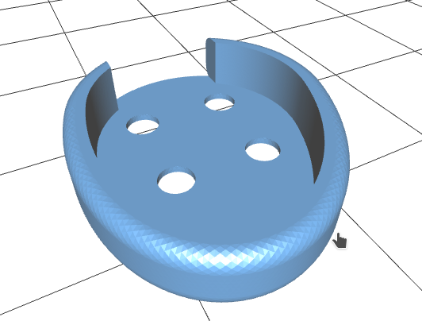

Arm Guard for KingKong/LDARC Fly Egg 130
======

- Design has been tested with PETG, ABS, and PLA. 
- PETG and ABS are suggested. PLA does the job but breaks easily so bring spares. 
- TPU will probably work fine.

